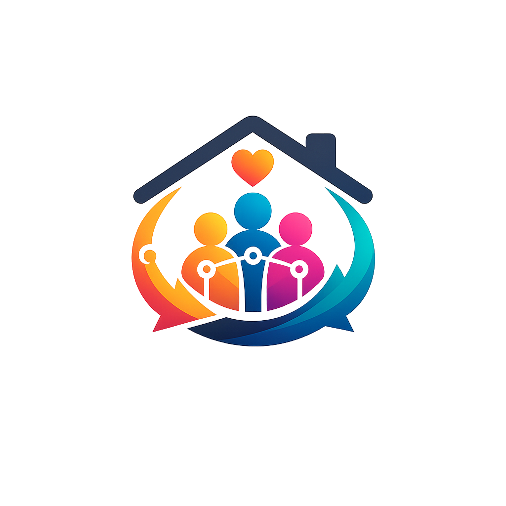
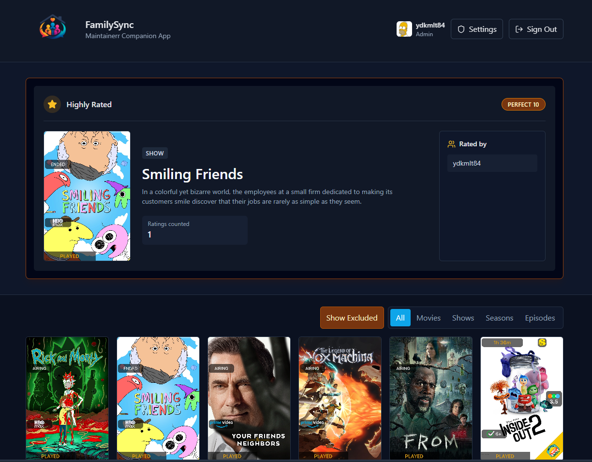
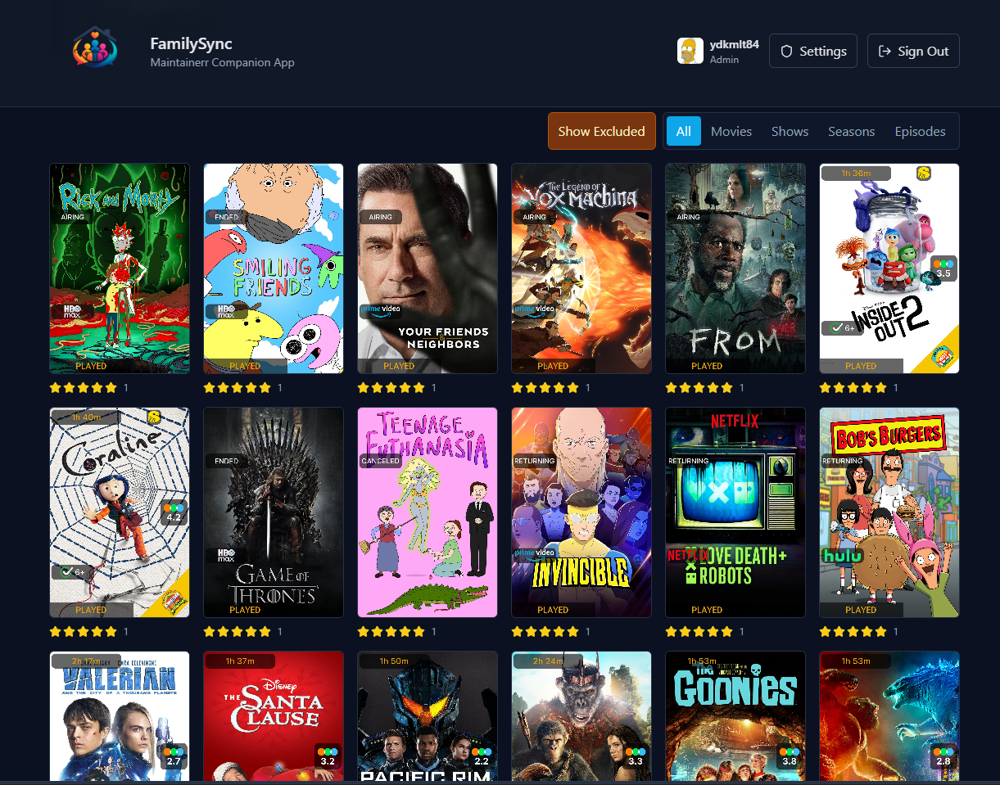
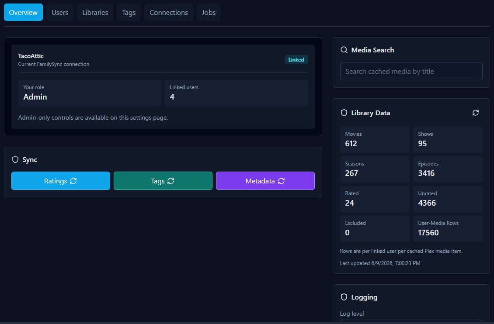

<p align="center">
  <br>
  <strong style="font-size: 1.75em;">Family Sync</strong>
</p>

FamilySync is a standalone, self-hosted companion application for Maintainerr. It lets Plex users link their accounts so FamilySync can collect and aggregate their Plex ratings, then optionally tag protected movies in Radarr or protected series in Sonarr.

Technically, it can be used in other ways but the original purpose was to catch the user ratings of users that are not the server owner, and have them be useful in Maintainerr.

Users link their Plex account once. After that, they interact through Plex by rating movies and shows.

FamilySync supports movies, shows, seasons, and episodes. Only movie and show ratings affect Radarr or Sonarr tags.

## Installation

### Configuration

The only required environment variable is the database encryption key:

```text
APP_ENCRYPTION_KEY=a-random-secret-with-at-least-32-characters
```

Generate one on Windows or Linux with Docker:

```powershell
docker run --rm node:24-alpine node -e "console.log(require('crypto').randomBytes(32).toString('hex'))"
```

Copy the printed value into `APP_ENCRYPTION_KEY`.

`APP_ENCRYPTION_KEY` encrypts Plex tokens and Radarr/Sonarr settings in SQLite. Back up this key separately. Losing or changing it makes stored secrets unrecoverable.

### Docker Compose

Use the included `docker-compose.yml`, or create one with the following configuration. Replace the encryption key and host volume path before starting the container.

```yaml
services:
  familysync:
    image: ghcr.io/ydkmlt84/familysync:main
    container_name: familysync
    hostname: familysync
    ports:
      - "6614:6614"
    environment:
      APP_ENCRYPTION_KEY: "<paste-generated-key-here>"
    volumes:
      - /host/volume/location/familysync:/config
    restart: unless-stopped
    healthcheck:
      test:
        - "CMD"
        - "node"
        - "-e"
        - "fetch('http://127.0.0.1:6614/').then(r => process.exit(r.ok ? 0 : 1)).catch(() => process.exit(1))"
      interval: 30s
      timeout: 5s
      retries: 3
      start_period: 20s
```

Start FamilySync:

```bash
docker compose up -d
```

Open `http://localhost:6614`.

### First-Run Setup

On first launch, FamilySync shows a setup wizard:

1. **Link Plex** - sign in with the Plex account that owns the server you want FamilySync to manage. The first server owner to link becomes the administrator; non-owner accounts cannot claim a new instance.
2. **Choose server connection** - select an auto-discovered Plex connection URL, or enter one manually.
3. **Choose libraries** - select the movie and TV libraries FamilySync should scan.
4. **Run the first sync** - optionally populate FamilySync before opening the main application.

The selected server identifier is persisted, so every future linked user must have access to that same server. If the owner account owns more than one Plex server, choosing among them is not yet supported.

The Plex server administrator can manage linked users, choose Plex libraries, configure Radarr and Sonarr, and run sync jobs. Non-admin linked users can view cached rated media.

Season and episode ratings are displayed but do not affect tags for the entire series. Radarr matches movies by TMDB ID, and Sonarr matches series by TVDB ID.

Plex metadata refresh is enabled weekly by default at 4:00 AM Sunday. It refreshes cached titles, posters, season and episode indexes, and external IDs without changing rating values or freshness timestamps. Administrators can change the schedule or run it immediately from the Jobs page.

## Screenshots



###



###


